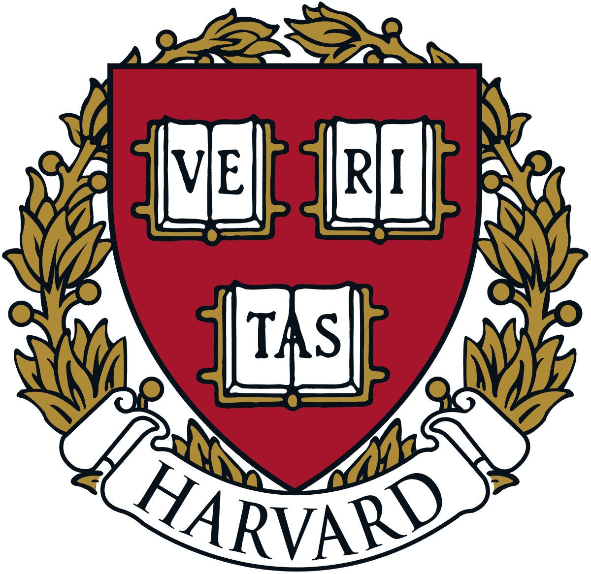

 

<h1 align="center">
Harvard CS50x — 2023
</h1>

___
___

## Table of Contents
- [PedroZappa's Coursework](#pedrozappas-cs50-coursework)
- [Course Resources](#course-resources)

___

## PedroZappa's CS50 Coursework

<!-- https://github.com/gepser/markdown-progress -->
  Week | Type          | Title       
  -----| ----------- | -----------  
  `Scratch` 
  0    | Problem Set 0     | [Scratch](C/pset0/)  
  _ `C` _
  1    | Practice Problems | [Debug](C/pp1/) 
  1    | Practice Problems | [Half](C/pp1/) |
  1    | Practice Problems | [Prime](C/pp1/) 
  1    | Lab 1             | [Population](C/lab1/) 
  1    | Problem Set 1     | [Hello](C/pset1/) 
  1    | Problem Set 1     | [Mario-less](C/pset1/) 
  1    | Problem Set 1     | [Cash](C/pset1/) 
  1    | Problem Set 1     | [Credit](C/pset1/) 
  _ `Arrays` _
  2    | Practice Problems | [Hours](C/pp2/)
  2    | Practice Problems | [N0 V0w3ls](C/pp2/)
  2    | Lab 2             | [Scrabble](C/lab2/) 
  2    | Problem Set 2     | [Readability](C/pset2/) 
  2    | Problem Set 2     | [Bulbs](C/pset2/) 
  2    | Problem Set 2     | [Caesar](C/pset2/) 
  _ `Algorithms` _
  3    | Practice Problems | [Recursive atoi](C/pp3/) 
  3    | Practice Problems | [Average Temperature](C/pp3/) 
  3    | Practice Problems | [Max](C/pp3/) 
  3    | Practice Problems | [Snackbar](C/pp3/) 
  3    | Lab 3             | [Sort](C/lab3/) 
  3    | Problem Set 3     | [Plurality](C/pset3/) 
  3    | Problem Set 3     | [Runoff](C/pset3/) 
  _ `Memory` _
  4    | Practice Problem 4 | [Bottom Up](C/pp4/) 
  4    | Practice Problem 4 | [License](C/pp4/) 
  4    | Lab 4              | [Smiley](C/lab4/smiley/) 
  4    | Lab 4              | [Volume](C/lab4/volume/) 
  4    | Problem Set 4     | [Filter-less](C/pset4/filter-less/)
  4    | Problem Set 4     | [Recover](C/pset4/recover/)
  _ `Data Structures` _

  ** | ** 

## [Course Resources](#course-resources)

Presented by EdX - https://www.edx.org/course/introduction-computer-science-harvardx-cs50x

Harvard University - https://www.harvard.edu/

CS50 Syllabus - https://cs50.harvard.edu/x/2023/

CS50 Codespaces - https://code.cs50.io

CS50 Problem sets - https://cs50.harvard.edu/x/2023/psets/

CS50 Class page - https://cs50.me/cs50x

CS50 C Manual Pages -  https://manual.cs50.io/

me50/PedroZappa - https://github.com/me50/PedroZappa

Webpage 2 PDF - https://www.web2pdfconvert.com/

Webpage 2 Markdown - https://codebeautify.org/html-to-markdown

PDF 2 Markdown - https://converter.app/pdf-to-md/

Pixel Art - https://cs50.ly/art
